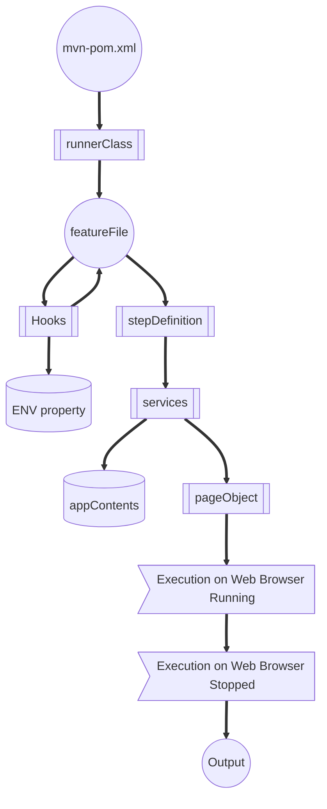

# Cucumber Test Automation project
## Table of Contents
- [Description](#description)
- [Installation](#installation)
- [Framework Structure](#framework-structure)
- [Technologies Used](#technologies-used)
- [Run Command](#run-command)
- [Result](#result)
- [Additional Support](#supports)
- [Authors](#authors)

### Description
To build Test Automation scripts for Web applications across different browsers, ensure parallel execution and used for CI/CD implementation.

### Installation
All below required to be set up beforehand
1. Install Java8
2. Set up JAVA_HOME path in ENV variables
3. Install Maven (3.8.2 and above versions)
4. Set up MAVEN_HOME path in ENV variables

### Framework Structure


- **Usage Across different projects**: The structure of the framework has been handled in a way to be used across multiple projects and to minimize git conflicts.
- **Page Object**: Used Page Object with Page Factory model to maintain separate object class for every single webpage. (src->test->java->pageObject->weatherShopper)
- **Content Handling**: All content in web application are kept in separate property file to make content maintenance at one stop. (src->test->resources->appContents->weatherShopper)
- **Methods Handling**: Separate methods for different functionality has been maintained on services package to increase code re-usability. (src->test->java->services->weatherShopper)
- **BDD Feature File**: Test scenarios are written using Gherkin language for easy understandability by stakeholders. (src->test->resources->featureFile->weatherShopper)
- **Runner Class**: 'Cucumber-TestNG' runner can be used for serial and parallel execution, 'Cucumber-Junit' runner for serial execution. (src->test->java->runnerClass->weatherShopper)
- **Environment Handling**: URL/Data for different environment can be handled during runtime. (src->main->resources->weatherShopper)
- **Global Methods Handling**: Code snippets to be used across all projects are handled under 'Methods' package. (src->main->java->Methods)
- **Handling before/after execution steps**: Initializing driver depends on requested browser type, quiting driver after execution etc are handled under 'Hooks' package (src->main->java->Hooks)
- **Screenshot at Failure**: Screenshot will be taken at a failure step and will be attached to report automatically.
- **Hybrid Framework**: This framework can execute test cases on Mobile, Web applications.

### Technologies Used
- **Maven**: To manage dependencies
- **Selenium**: To automate web application
- **Appium:** To automate Mobile application
- **Cucumber**: For BDD design
- **Junit4**: To manage and run scripts
- **Cucumber-TestNG**: For parallel runner
- **Java**: Programming language
- **WebDriver Manager**: To manage different browser's drivers
- **Design Pattern**: Page Object, Facade
- **Assertion:** Hard, Soft assertion

### Supports
1. **Web Automation**:
   Developed to support Test Automation on Web applications
2. **Mobile Automation**:
   Developed in a way to support same code for both Android, iOS applications; iOS snippets yet to be implemented
3. **CI/CD**:
   We are using CLI commands to run script, this can be directly used in CI/CD tools
4. **Execution on Different browsers**:
   Supports Chrome, Firefox, Edge (can be extended to different browsers)
5. **Parallel execution**:
   Developed scripts to be thread safe for parallel execution
6. **Screenshot/Log**:
   Can take screenshot, write logs at any step and attach to report.
7. **Extended Reports**:
   Extended Cucumber reports will be generated after every execution.

### Run Command
######Navigate to folder path which contains pom.xml file and use any of the following commands
**Cucumber-TestNG Runner** (Supports Serial and Parallel execution)

IDE(IntelliJ) Terminal: 
```
mvn clean test -P=weatherShopperParallel '-Dcucumber.filter.tags="@WSsanity"' -Denv="prod"
```
Windows CLI:
```
mvn clean test -P=weatherShopperParallel -Dcucumber.filter.tags="@WSsanity" -Denv="prod"
```

**Cucumber-Junit Runner:** (Supports Serial execution)

IDE(IntelliJ) Terminal:
```
mvn clean test -P=weatherShopper '-Dcucumber.filter.tags="@WSsanity"' -Denv="prod"
```
Windows CLI:
```
mvn clean test -P=weatherShopper -Dcucumber.filter.tags="@WSsanity" -Denv="prod"
```

### Result
Path: 
```
'output->cucumber-html-report'
```

### Authors
#### **_Aravind Mari Thirupathi_**